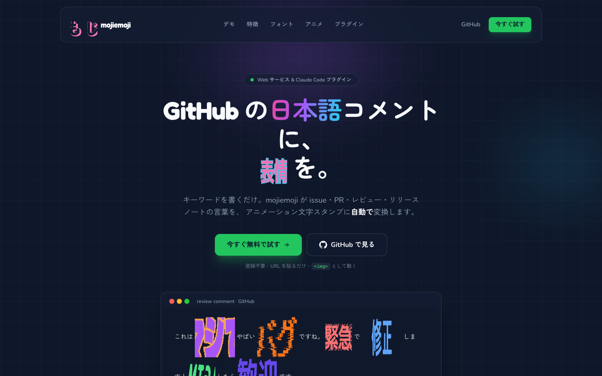

# mojiemoji-site

<p align="center">
  
</p>

[](https://mojiemoji-site.yumejustice.workers.dev)     

[**mojiemoji**](https://mojiemoji.jozo.beer) — 日本語の GitHub Markdown のキーワードだけを、アニメーション文字スタンプに自動で置き換えるサービス＆ Claude Code プラグインの**ランディングページ**。スタンプ画像そのものを使った自己デモが特徴です。

> 🚀 **Live:** **<https://mojiemoji-site.yumejustice.workers.dev>**

## このページについて

- **題材**: [mojiemoji.jozo.beer](https://mojiemoji.jozo.beer)（文字スタンプサービス）と [jozobeer/mojiemoji-plugin](https://github.com/jozobeer/mojiemoji-plugin)（Claude Code プラグイン）の紹介
- **自己デモ**: ページ内のスタンプはすべて mojiemoji サービスのライブ ``。16 書体・34 アニメをそのまま展示
- **ゼロ JS**: Astro の静的出力。クライアント JS なしで、画像 URL だけで動く

## 技術スタック

| 領域 | 採用 | 理由 |
|---|---|---|
| サイト生成 | **Astro 6**（静的出力） | マーケ LP はアプリではなくコンテンツ。`dist/` をそのまま CDN へ |
| スタイル | **Tailwind CSS 4**（`@tailwindcss/vite`） | デザイントークンを `@theme` に集約 |
| パッケージ管理 | **bun** | 依存解決の堅牢性 + Workers Builds が `bun.lock` を自動検出 |
| ホスティング | **Cloudflare Workers**（static assets） | エッジ配信・無料 `workers.dev`・Git 連携の自動デプロイ |
| デザイン指針 | **ui-ux-pro-max** | "Vibrant & Block-based" 指針を反映（payload は gitignore） |

## 開発

```bash
bun install        # 依存をインストール
bun run dev        # 開発サーバ（ホットリロード）
bun run build      # dist/ に静的ビルド
bun run preview    # ビルド済み dist/ をローカル配信
```

## デプロイ

Cloudflare Workers の **static assets** として配信します。設定は [`wrangler.jsonc`](./wrangler.jsonc)（`main` スクリプト無しのアセット専用 Worker）。

```bash
bun run build
wrangler deploy    # wrangler OAuth セッションで認証。即 *.workers.dev に公開
```

`main` への push ごとの自動デプロイは **Workers Builds（Git 連携）** で行います。これは Cloudflare ダッシュボードで一度だけ接続する操作で、接続後は push → `bun run build` → デプロイが自動で走ります（GitHub Actions のワークフローファイルは不要）。

## リンク

- 🌐 サービス: [mojiemoji.jozo.beer](https://mojiemoji.jozo.beer)
- 🧩 プラグイン: [jozobeer/mojiemoji-plugin](https://github.com/jozobeer/mojiemoji-plugin)

## ライセンス

MIT
